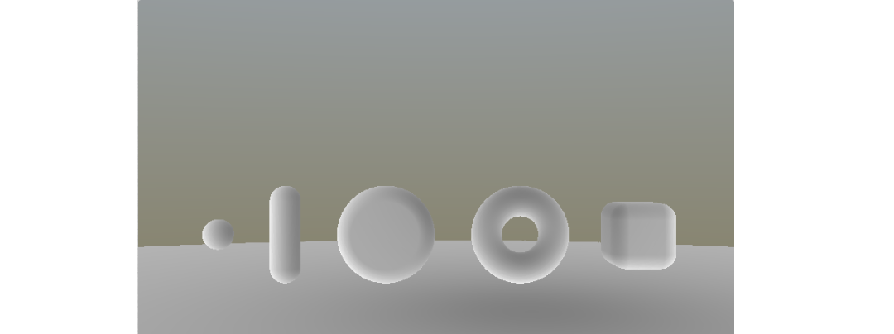
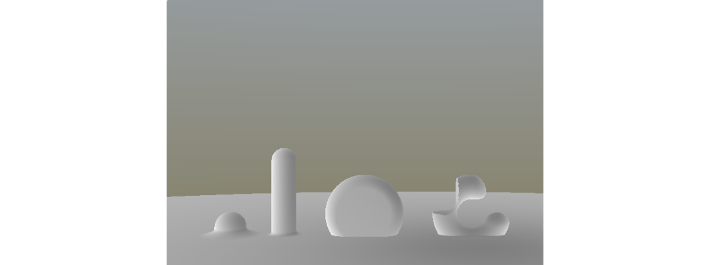
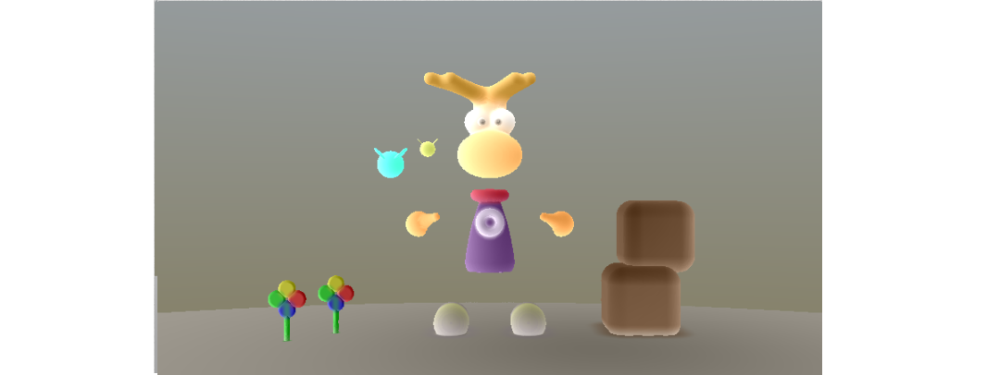

PARIS Axel  
RICHE Vincent

# <center> RAPPORT </center>
# <center> Modélisation Géométrique : Surface Implicite </center>

## I. Squelettes

Nous avons implémenté les squelettes des primitives *Segment*, *Disque*, *Cercle*, *Cube*, *Plan*. 
Les résultats obtenus sont visibles dans la figure 1.

*<center>Figure 1 : Squelettes</center>*

## III. Opérateurs
Nous avons développé les opérateurs *Blend*, *BlendN*, *Union*, *Intersection*, *Négation*, *Minus*, *Soustraction*, *Division*.  
La figure 2 montre nos résultats : le point est *Blend* avec le plan, le segment est *BlendN* (ici N = 5.0) avec le plan, le disque utilise l'*Union* avec le plan et le cercle utilise l'opérateur *Substract* avec un cube (à gauche) et l'opérateur *Minus* avec un autre cube (à droite).

*<center>Figure 2 : Opérateurs</center>*

## IV. Couleurs des objets

Une fois tout nos objets créées, nous calculons leurs couleurs. Pour cela nous multiplions chaque fonction par la couleur désirée et divisons le tout par la somme des fonctions. Le calcul est donc le suivant pour trois fonctions: 

```
    c = F1 * color1 + F2 * color2 + F3 * color3;
    c /= F1 + F2 + F3;
```

La figure 3 illustre différentes couleurs sur différentes objets.

*<center>Figure 3 : Couleurs</center>*

## Animations d'objets

Nous avons implémentées quatre types d'animations suivant le scale, la position et la rotation:
- *Scale* : fait varier le scale au cours du temps en fonction du valeur minimum et maximum et d'une vitesse de transition. 
- *Position* : fait varier la position d'un objet au cours du temps en fonction d'une position de début et de fin et d'une vitesse de transition.
- *Rotation* : fait tourner un objet autour soit des axes des X ou des Z en fonction d'un radius et d'une vitesse de transition.

## V. Notre scène
Nous avons décidées regroupant au mieux les différents squelettes, opérateurs, et animations que nous avons implémentés. Pour cela, nous avons fais le personnage Rayman accompagné de deux lucioles qui virevoltent autour de lui. la scène accompagné de quelques fleurs et de caisses en bois.

Nous avons 45 primitives, 7 animations, et 17 couleurs.

La figure 4 montre un screenshot de notre scène. 

*<center>Figure 4 : Notre scène</center>*

Une démonstration du shader est aussi disponible à cette adresse : https://www.shadertoy.com/view/MtjyDd

## VI. Conclusion