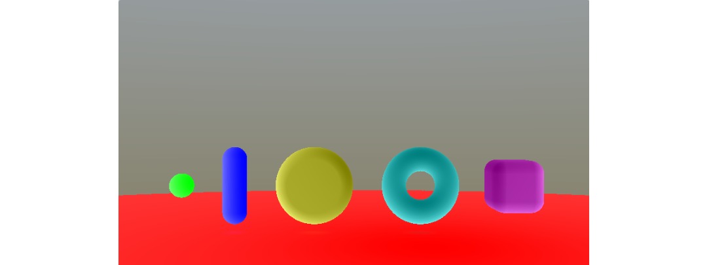

PARIS Axel  
RICHE Vincent

# <center> RAPPORT </center>
# <center> Modélisation Géométrique : Surface Implicite </center>

## I. Squelettes

Nous avons implémenté les squelettes des primitives *Segment*, *Disque*, *Cercle*, *Cube*, *Plan*. La primitive *Point* étant déjà fourni.  
Les résultats obtenus sont visibles dans la figure 1.

*<center>Figure 1 : Squelettes des primitives</center>*

## II. Opérateurs
Nous avons développé les opérateurs *Blend*, *BlendN*, *Union*, *Intersection*, *Négation*, *Minus*, *Soustraction*.  
La figure 2 montre nos résultats. Dans cette scène, nous avons les primitives et opérateurs suivants :
- Le point est *Blend* avec le plan.
- Le segment est *BlendN* (ici N = 5.0) avec le plan.
- Le disque utilise l'*Union* avec le plan.
- Le cercle utilise l'opérateur *Substract* avec un cube (à gauche) et l'opérateur *Minus* avec un autre cube (à droite). 

*<center>Figure 2 : Opérateurs</center>*

## IV. Couleurs des objets

Une fois tout nos objets créés, nous calculons leurs couleurs. Pour cela nous multiplions le potentiel de l'objet avec la couleur souhaitée et divisons le tout par la somme des potentiels de tous les objets dans la scène. Pour trois objets aux potentiels F1, F2, F3, la couleur final sera donc : 

```
    c = F1 * color1 + F2 * color2 + F3 * color3;
    c /= F1 + F2 + F3;
```

La figure 3 illustre le calcul des couleurs par primitive. Il n'y a pas d'intersection dans la scène, les couleurs ne sont donc pas *Blend* entre les primitives.

*<center>Figure 3 : Couleurs par primitive</center>*

## Animations

Nous avons implémenté quatre types d'animation suivant le scale, la position et la rotation:
- *Scale* : fait varier le scale au cours du temps en fonction d'une borne minimale et maximale ainsi que d'une vitesse. 
- *Position* : fait varier la position d'un objet au cours du temps en fonction d'une position de début et de fin et d'une vitesse de déplacement.
- *Rotation* : fait tourner un objet autour d'un axe à une certaine distance et à  certaine vitesse.

## Optimisation

Nous avons améliorer l'algorithme de *Sphere Tracing* grâce à [cet article](http://erleuchtet.org/~cupe/permanent/enhanced_sphere_tracing.pdf).
Grâce à cela, nous avons un speedup entre 1.5 et 2 sur nos machines respectives (GTX1050M et IntelHD4000).

Nous avons également modifié manuellement la constante de Lipschitz pour trouver le bon rapport vitesse/qualité. Nous l'avons laissé à 2 dans le programme que nous avons rendu. Ce changement améliore encore les performances avec un speedup d'environ 1.5.

Pour la fonction de falloff, nous avons calculé la dérivée première et seconde :
$$$
f(x) = (1 - x^2)^3
$$$
$$$
f'(x) = -6x(1 - x^2)
$$$
$$$
f''(x) = -30x^4 - 36x^2 - 6
$$$

f''(x) a une racine pour x = 0.45 environ. Cela représente un minimum de f'(x) dans l'intervalle [0, 1]. f'(0.45) = -1.72. Donc la constante de Lipschitz pour la fonction de falloff est 1.72. Il en va de même pour la fonction de Blob et les autres primitives à squelette qui utilise la distance euclidienne.

## V. Notre scène
Nous avons décidé de créer une scène montrant au mieux les différents squelettes, opérateurs, et animations que nous avons implémenté. Pour cela, nous avons modélisé le personnage de Rayman accompagné de deux lucioles qui virevoltent autour de lui. Pour remplir un peu le décor, nous avons également modélisé quelques fleurs et des caisses en bois.

La scène finale contient 45 primitives, 7 animations, et 17 couleurs différentes. Les performances obtenues sur nos machines respectives sont de l'ordre de 20 à 30 FPS. Toutes les primitives et tous les opérateurs ont été utilisé dans cette scène.

La figure 4 montre le rendu final obtenu.

*<center>Figure 4 : La scène finale avec Rayman au centre, les fleurs à gauches, les lucioles au centre et les caisses en bois à droite</center>*

Le shader est accessible directement à cette adresse : [ShaderToy](https://goo.gl/4yXEWc)

## VI. Conclusion
En conclusion, nous avons beaucoup aimé ce TP et sommes satisfait de la scène que nous rendons.
Une amélioration possible aurait été de calculer la constante de Lipschitz à la main pour de meilleurs résultats.